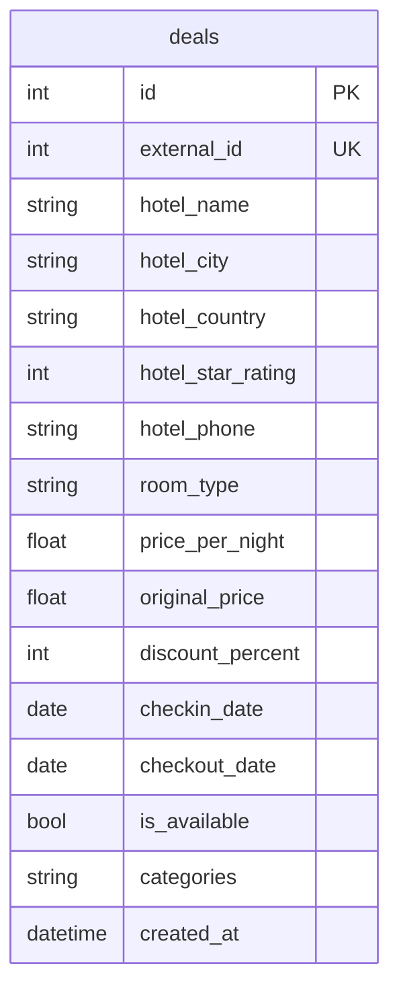
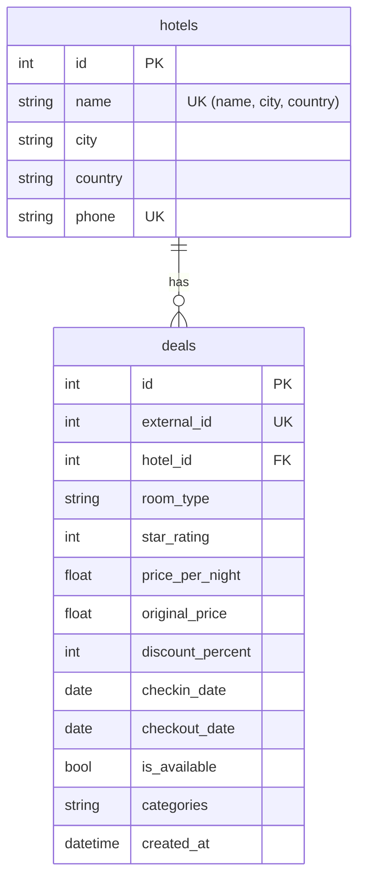

# Backend Mock Interview — 90-Minute Playbook

Linear guide for the Super.com live coding interview. Follow it top to bottom.

---

## Phase 1: Present the Scaffold (0–2 min)

Show the interviewer that the environment is running and explain the tech choices. Do this in order:

### 1. Prove it works

```bash
docker compose up -d db
mise run dev:backend
curl localhost:8000/health   # → {"status":"ok"}
```

Open Swagger UI at `localhost:8000/docs` — show the `/health` endpoint live.

Swagger UI is built into FastAPI — no setup, no extra packages. FastAPI reads your endpoint
signatures (path params, query params, Pydantic models, status codes) and auto-generates an OpenAPI
spec. Swagger UI renders that spec as an interactive web page where you can see every endpoint and
make live requests with "Try it out" buttons. There's also ReDoc at `localhost:8000/redoc`
(read-only, better for documentation). Both are enabled by default.

### 2. Show the project structure (point, don't explain)

```
mock-interview-v2/
├── CLAUDE.md              # root rules — git, mise, docs, monorepo
├── backend/
│   ├── CLAUDE.md          # backend rules — FastAPI, SQLAlchemy, etc
│   ├── pyproject.toml     # dependencies (uv sync to install)
│   ├── alembic.ini        # Alembic config (points to migrations)
│   ├── alembic/
│   │   ├── env.py         # migration runner — import models here
│   │   └── versions/      # (empty — no migrations yet)
│   ├── src/app/
│   │   ├── main.py        # FastAPI app, health endpoint, DB alias
│   │   ├── config.py      # pydantic-settings: env vars, defaults, .env
│   │   │                  #   Dev: reads .env or falls back to defaults
│   │   │                  #   Prod: real env vars from the platform
│   │   │                  #     K8s: ConfigMaps + Secrets via envFrom
│   │   │                  #     ECS: environment[] + secrets[] from SM
│   │   ├── middleware.py  # request ID, logging context
│   │   ├── logging.py     # structlog configuration
│   │   └── db/
│   │       └── session.py # Base, engine, get_db dependency
│   └── tests/
│       ├── conftest.py    # Postgres test DB override, fixtures
│       └── test_health.py # smoke test for /health
```

> "No models, routes, or business logic yet — that's what we'll build together."

#### CLAUDE.md — rules for the AI agent

Project-level instructions file that Claude Code reads automatically — coding conventions,
architectural patterns, constraints. Merges hierarchically: root `CLAUDE.md` (monorepo-wide rules)
\+ `backend/CLAUDE.md` (Python/FastAPI-specific). It's a living document — you add new rules as
patterns emerge during the interview (demonstrated in Round 1 Step 6 and Round 5).

For the full explanation (hierarchical merging, what each file contains), see
[1-claude-md-explained.md](1-claude-md-explained.md).

#### 30-second pitch — Walk through the stack

> "The scaffold uses **mise** to manage tool versions and tasks — everything is `mise run <task>`.
> A **pre-commit hook** runs ruff, mypy strict, and pytest on every commit, so AI-generated code
> that doesn't pass gets rejected automatically. The framework is **FastAPI** — I chose it because
> it's async-native, so every database call yields to the event loop instead of blocking a thread.
> That means one process handles hundreds of concurrent requests without spawning extra workers.
> **Postgres** runs in Docker for both dev and tests — a separate `super_test` database keeps test
> data isolated. Each test gets a fresh schema that's dropped when it ends, so there's no shared
> state and no flaky failures. The ORM is
> **SQLAlchemy 2.0** with typed models, and **Alembic** handles migrations. I also have a
> **CLAUDE.md** file with project rules so the AI agent follows my conventions from the start."

If asked to expand on any part of the pitch, see
[2-scaffold-deep-dives.md](2-scaffold-deep-dives.md) — one section per technology (mise, pre-commit,
FastAPI async, PostgreSQL, SQLAlchemy 2.0, Alembic).

---

## Phase 2: Build the Application (2–75 min)

The interviewer will give you a CSV and ask you to build a backend on top of it. Below is a
realistic mock scenario that exercises every Senior skill Super.com evaluates. Practice with this
until the real interview.

### The Mock Scenario

**Interviewer gives you**: A CSV file (`deals.csv`, ~50,000 rows) with hotel deal data.

Sample rows: [deals-sample.csv](deals-sample.csv)

15 columns: `id`, `hotel_name`, `hotel_city`, `hotel_country`, `hotel_star_rating`, `hotel_phone`,
`room_type`, `price_per_night`, `original_price`, `discount_percent`, `checkin_date`,
`checkout_date`, `is_available`, `categories`, `created_at`.

### Evaluation Criteria — keep this in mind during every round

- **Re-explain the problem before prompting AI** — Restate every requirement aloud before typing
  a prompt
- **Explain your intent before using AI** — Say "I'm going to ask Claude to [X] because [Y]"
- **Describe modifications to AI code** — Narrate every change: "I'm changing [X] to [Y]
  because [Z]"
- **Identify limitations in AI output** — Point out issues before accepting: "This uses lazy
  loading, I need eager"
- **Adjust approach as requirements evolve** — Pause, restate the change, identify affected
  layers, then prompt
- **Recognize incorrect AI output** — Catch bugs: wrong types, missing error handling
- **Ask clarifying questions first** — Always ask the interviewer before assuming
- **Assess correctness, efficiency, maintainability** — Review generated code out loud, suggest
  improvements
- **Discuss scalability and performance** — Proactively mention indexes, pooling, pagination
  trade-offs

### Round 1 — The Opening Ask

> **Interviewer**: "Here's a CSV of hotel deals. Load it into your database and build an API so
> clients can list and view individual deals."

**Before you touch any tool**, say this aloud:

> "Let me start by inspecting the CSV with pandas to understand what we're working with."

**Quick pandas inspection** — use `mise run python` instead of bare `python` so the REPL
runs inside the project's virtual environment with all backend dependencies available to import.
The mise `python` task sets `PYTHONSTARTUP` to `backend/scripts/pythonstartup.py`, which
auto-loads two things so you don't type boilerplate during the interview:
- `pd` — `import pandas as pd` with `display.max_columns` set to show all columns
- `db` — a SQLAlchemy `create_engine` instance connected to `postgresql://super@localhost:5432/super`

```bash
mise run python
```

```python
>>> import pandas as pd
>>> df = pd.read_csv("deals.csv")

# equivalent to 
# df.describe(include="all")
# df.head()
# df.shape
>>> df 

df.dtypes
# id                     int64
# hotel_name               str
# hotel_city               str
# hotel_country            str
# hotel_star_rating      int64
# hotel_phone              str
# room_type                str
# price_per_night      float64
# original_price       float64
# discount_percent       int64
# checkin_date             str
# checkout_date            str
# is_available            bool
# categories               str
# created_at               str


>>> df['hotel_phone'].unique()
<StringArray>
['+49-30-555-3780', '+1-312-555-5133', '+1-415-555-7498', '+1-514-555-3584',
 '+39-06-555-5557', '+1-416-555-1333', '+1-403-555-7939',  '+61-2-555-7211',
  '+61-2-555-4185',  '+81-3-555-6977',
 ...
 '+1-604-555-2790',  '+81-3-555-8491', '+1-310-555-7528', '+31-20-555-8018',
  '+33-1-555-9785', '+1-416-555-4228',  '+65-6-555-7991', '+34-93-555-7592',
 '+971-4-555-2612', '+1-312-555-7543']
Length: 150, dtype: str

# Normalization checks
df.groupby("hotel_phone")[["hotel_name", "hotel_city", "hotel_country"]].nunique().max()
# hotel_name       1
# hotel_city       1
# hotel_country    1
# ← For every unique hotel_phone, there is exactly one hotel_name, one hotel_city,
#   and one hotel_country. So phone uniquely identifies a hotel — it's a candidate key,
#   confirming the 1:N relationship from the reverse direction.

df['hotel_star_rating'].unique()
# array([4, 5, 3, 2, 1])

# star_rating is a deal property
>>> vc = df.groupby("hotel_phone")["hotel_star_rating"].value_counts()
# +1-212-555-1420  4                    118
#                  3                    108
#                  5                     95
#                  2                     36
#                  1                     11
#                                      ... 
# +971-4-555-7570  5                    111
#                  4                    110
#                  3                     76
#                  2                     29
#                  1                      6
# Name: count, Length: 750, dtype: int64

>>> vc.unstack(fill_value=0)
# hotel_star_rating   1   2    3    4    5
# hotel_phone                             
# +1-212-555-1420    11  36  108  118   95
# +1-212-555-2040     2  22   77  100  140
# +1-212-555-2776     1  23   58  103  147
# +1-212-555-4467     3  30   68  110  128
# +1-212-555-4598     5  26   79  107  106
# ...                ..  ..  ...  ...  ...
# +971-4-555-2612     5  33   89  111  101
# +971-4-555-4613     4  27   68  110  126
# +971-4-555-7311     1  13   48  125  180
# +971-4-555-7381     5  28   81  111   97
# +971-4-555-7570     6  29   76  110  111

# [150 rows x 5 columns]

# Unique hotels subset
hotel_columns = ['hotel_name', 'hotel_city', 'hotel_country', 'hotel_phone']
hotels = (df[hotel_columns]
        .drop_duplicates(subset=['hotel_phone'])
        .rename(columns=lambda c: c.replace('hotel_', '')))
#                    name           city               country            phone
# 0        Lakeside Court         Berlin               Germany  +49-30-555-3780
# 1           Metro Tower        Chicago         United States  +1-312-555-5133
# 2           Crown Tower  San Francisco         United States  +1-415-555-7498
# 3            City Lodge       Montreal                Canada  +1-514-555-3584
# 4          Silver Hotel           Rome                 Italy  +39-06-555-5557
# ..                  ...            ...                   ...              ...
# 566  Lakeside Residence        Toronto                Canada  +1-416-555-4228
# 596     Crown Residence      Singapore             Singapore   +65-6-555-7991
# 620       Golden Resort      Barcelona                 Spain  +34-93-555-7592
# 714        Harbor Hyatt          Dubai  United Arab Emirates  +971-4-555-2612
# 755      Golden Central        Chicago         United States  +1-312-555-7543
#
# [150 rows x 4 columns]
```

then restate the plan with data-informed questions:
> 1. "ok so i can see the csv has 50,000 rows and 15 columns. 
> 2. 150 unique hotels across 50,000 deal rows.
> 3. Phone number uniquely identifies a hotel — it's the candidate key. The triplet (name, city,
>    country) is also unique and worth enforcing as an extra uniqueness constraint.
> 4. We also know the column types
>
> "a few questions before i start. Grounded in what you just saw:

- Would you prefer keep everything flat in one table?
- I think it's safe **normalize data into a `hotels` table** with a one-to-many relationship to deals. 
    - "two hotels in different cities could share a name - 
    May I identify unique hotels by `name`, `city` and `country`, or should I try something else, maybe `phone number`?
- The CSV has an `id` column — is this a primary key from an external system that I should
    preserve, or can I let the database generate its own IDs? If it's external, I'd store it as
    `external_id` and keep the auto-increment PK separate — otherwise inserting explicit IDs
    desynchronizes PostgreSQL's sequence and breaks future inserts."
- should i add check constraints at the database level?"
    - "`star_rating` ranges from 1 to 5,
    - `discount_percent` from 0 to 100,
    - prices are all positive.

#### building round 1 — step by step

**step 1 — create the sqlalchemy models**

1A: Denormalized table

**say aloud**: 

- "I'll create a single model: deal — it keeps hotel info denormalized right on the row."
- after migrating I can \copy the file straight in 
- "tradeoff: hotel data is duplicated across rows, but for a read-heavy deals API this is fine — fewer joins, simpler queries."

prompt claude code (plan mode):

"create one sqlalchemy model: Deal. here's the schema:


add check constraints:

- hotel_star_rating between 1 and 5
- price_per_night > 0
- original_price > 0
- discount_percent between 0 and 100
- checkout_date > checkin_date

**inspect `models.py`** — review aloud:

- "single flat table — every column matches a csv header, just with hotel_ prefix on the hotel fields."
- "`external_id` preserves the CSV's original ID for traceability — the database generates its own PK."
- "types match the csv — numeric for prices, date for dates, boolean for is_available."
- "check constraints guard data quality at the db level — same ones I'd have in the normalized version."
- "no foreign keys, no relationship setup"

Normalized:

**say aloud**: 

- i'll ask Claude Code to create two models: hotel and deal. 
- deal has a `hotel_id` foreign key pointing to hotel, but the csv 
doesn't have `hotel_id` — i need to extract unique hotels first
- hotel are unique by country, city, name
- after inserting them, get their ids
- insert deals with the fk mapping. 
- It's a complex parsing logic that I can delegate to Claude Code"

**prompt claude code** (plan mode):

> "create two sqlalchemy models: hotel and deal. here's the ER diagram

> add unique constraint (name, city, country)
> add check constraints: 
- `star_rating` between 1 and 5
- `price_per_night > 0`
- `original_price > 0`
- `discount_percent` between 0 and 100
- `checkout_date > checkin_date`

**inspect `models.py`** — review aloud:
- "unique constraint on `(name, city, country)`"
- "FK `hotel_id`, non-nullable — every deal belongs to exactly one hotel, with index"
- "`external_id` preserves the CSV's original ID — unique constraint so we can look up by source ID"
- "types match the csv — `decimal` for prices, `date` for dates, `bool` for is_available."
- "bidirectional access — the `relationship()` on Hotel uses `back_populates='hotel'`"
- "primary key uses `mapped[int]` with `mapped_column(primary_key=True)`"
- "no business logic in the model — it's a pure data representation"

OPTIONAL: see [3-sqlalchemy-naming-conventions.md](3-sqlalchemy-naming-conventions.md)

**If asked: "Why is everything in one `models.py` instead of one file per model?"**

> "Two tightly-coupled models in a single file is intentional. Unlike Ruby, where Rails' autoloader
> (Zeitwerk) resolves classes by name at runtime — so `Hotel` and `Deal` can reference each other
> freely without either file importing the other — Python requires explicit imports. Splitting into
> separate files creates circular imports (Hotel imports Deal for its relationship, Deal imports
> Hotel) that need workarounds like `TYPE_CHECKING` guards. That's boilerplate solving a problem
> you created by splitting the file.
>
> If the domain grew — say we add users, bookings, payments — I'd split into a `models/` package
> grouped by **bounded context**: `models/catalog.py` (Hotel, Deal, Category),
> `models/booking.py` (Booking, Payment), `models/identity.py` (User, Session). Each file contains
> models that reference each other heavily but rarely cross context boundaries. Cross-context
> relationships use explicit foreign keys without `relationship()` — no import needed.
>
> The rule: one file per bounded context, not one file per table. Two models in one file is the right
> call here — I'd refactor when there's a reason to, not preemptively."

**step 2 — generate and apply the alembic migration**

**say aloud**: "The models look good. Now I'll generate the Alembic migration and inspect it before
applying — I never blindly run migrations."

```bash
mise run db:generate "create hotels and deals tables"
```

**inspect the migration file** — open `alembic/versions/<hash>_create_hotels_and_deals_tables.py`
and review aloud:

- "two `create_table` calls — `hotels` first (parent), then `deals` (child with FK)"
- "`hotels.id` is the primary key, auto-increment"
- "`deals.hotel_id` has a `ForeignKeyConstraint` pointing to `hotels.id` — non-nullable, with index"
- "check constraints are in the migration: `star_rating` 1–5, prices positive, `discount_percent`
  0–100, `checkout_date > checkin_date`"
- "the `downgrade()` drops tables in reverse order — `deals` first (FK dependency), then `hotels`"

apply the migration:

```bash
mise run db:migrate
```

**verify in DBeaver** — open DBeaver, connect to `localhost:5432` (user `super`, database `super`). You should see 
- `hotels` with 7 columns
- `deals` with 12 columns (including `external_id`, `hotel_id` FK).
no rows yet.
- FK exist
- check constraints exist

> **commit 1**: `feat: add hotel and deal models with 1:n relationship and alembic migration`

**step 2b — integration tests for the models**

**say aloud**: "Now that the tables are created, let's make sure the SQLAlchemy models are correct
and we can create records using the ORM. I'll ask Claude to add integration tests — they hit a
real Postgres database (`super_test`), so they verify the full stack: ORM mapping, FK constraints,
and check constraints at the database level."

**prompt claude code**:

> "add integration tests for the hotel and deal models: create a hotel and a deal through the ORM,
> verify the 1:N relationship works in both directions (`hotel.deals`, `deal.hotel`). test that
> check constraints reject invalid data — negative price, star_rating outside 1–5, checkout before
> checkin — and raise `IntegrityError`."

guardrails:

```bash
mise run test:backend && mise run typecheck:backend
```

**review aloud**:
- "these are integration tests, not unit tests — they run against a real Postgres instance.
  that's intentional: we're verifying DB-level constraints, not mocking them."
- "tests verify the 1:N relationship in both directions — not just that valid data inserts."
- "check constraint tests confirm `IntegrityError` on invalid data — negative price,
  star_rating outside 1–5, checkout before checkin."
- "each test gets a fresh schema — no shared state between tests."

adjust if review found issues — fix and re-run guardrails.

> **commit 2**: `test: add model integration tests for ORM relationships and check constraints`

**step 3 — load the csv data**

**say aloud**: "the csv has no hotel IDs — so I can't insert deals directly. Instead of
writing a loader script with ORM inserts and flush-for-IDs, I'll treat this as a data wrangling
problem: pandas to extract hotels, load them with `to_sql`, query the generated IDs back, merge
into deals, and load deals. All in one REPL session, no intermediate files."

**do it yourself** (Python REPL — pure pandas, SQLAlchemy only as DB adapter):

**Load hotels**:

```python
# pd, db, df, hotels already in REPL from inspection step

# Hotels: already extracted in inspection step — load directly
# No need to memorize
hotels.to_sql()
# TypeError: NDFrame.to_sql() missing 2 required positional arguments: 'name' and 'con'

hotels.to_sql('hotels', db)
# ValueError: Table 'hotels' already exists.

hotels.to_sql('hotels', db, if_exists='append')
# psycopg2.errors.UndefinedColumn: column "index" of relation "hotels" does not exist
# LINE 1: INSERT INTO hotels (index, name, phone, city, country) VALUE...
# index is the pandas index in the dataframe

hotels.to_sql('hotels', db, if_exists='append', index=False)
# 150

# Verify
pd.read_sql("SELECT count(*) FROM hotels", db)   # → 150
pd.read_sql("SELECT * FROM hotels LIMIT 5", db)
```

**Load deals associated with hotels**:

```python
# Deals: resolve hotel_id via merge on phone, load
hotel_ids = pd.read_sql("SELECT id AS hotel_id, phone AS hotel_phone FROM hotels", db)
deals = (df.merge(hotel_ids)  # auto-joins on columns with the same name: 'hotel_phone'
           .rename(columns={'id': 'external_id', 'hotel_star_rating': 'star_rating'})
           .drop(columns=hotel_columns))
deals.to_sql('deals', db, if_exists='append', index=False, method='multi')
# → 50000

# Verify
pd.read_sql("SELECT count(*) FROM deals", db)    # → 50000
pd.read_sql("""
    SELECT h.name, h.city, d.room_type, d.price_per_night
    FROM deals d JOIN hotels h ON d.hotel_id = h.id
    LIMIT 3
""", db)
```

**say aloud (why this approach)**:

> "pandas lets me transform the raw CSV and populate both tables in one session — extract
> unique hotels, load them, resolve the generated IDs back into deals via merge, and bulk-insert.
> The same logic could live inside an Alembic data migration for repeatability.
>
> I turned a code problem into a data problem. The FK resolution is just a pandas merge on phone.
> `to_sql` with `method='multi'` batches into multi-row INSERTs — fast enough for 50k rows.
> No ORM boilerplate, no intermediate files, one REPL session. For millions of rows I'd load
> the raw CSV into a staging table with `to_sql`, then `INSERT INTO deals SELECT ... FROM
> staging_deals JOIN hotels USING (phone)` — FK resolution stays in the database."

> **Commit 3**: `feat: load CSV data via pandas (extract hotels, resolve FKs, bulk insert)`

#### Step 4 — CRUD endpoints (READ: list)

Follow this loop for every feature from now on.

**1. RESTATE requirement aloud**:

> "I need a list endpoint for deals. Each deal response includes its hotel info. I'll use
> structured error responses so clients can handle errors programmatically. Integration tests for
> happy and error paths."

**2. TELL interviewer what you'll ask Claude to do**:

> "Before I start, let me show you the backend architecture I documented."
>
> *Open [architecture.md](../docs/architecture.md) — show the Layers section.*
>
> "Each request flows through four layers: **schema** (request/response shapes), **repository**
> (database queries), **service** (business logic), **router** (HTTP wiring). Dependency injection
> gives every endpoint a database session automatically.
>
> Because these decisions are already written down, I can delegate the implementation to Claude Code
> and review against these standards. If something's off, I fix the code or refine the
> instructions — so the next generation is better.
>
> If you're good with these patterns, I'll prompt Claude to generate the `/deals` list endpoint."

**3. PROMPT Claude Code** (plan mode):

> "Create a list endpoint for deals (`GET /deals`). Each deal response should include its hotel
> info (name, city, country, avg_star_rating). `avg_star_rating` is a computed field — the average
> of `star_rating` across all deals belonging to that hotel. Use structured error responses:
> `{"error": {"code": "...", "message": "..."}}` — so clients can programmatically handle errors
> instead of parsing free-text strings.
>
> Add integration tests: list returns deals with nested hotel data including avg_star_rating, list
> on empty DB returns empty list."

**4. VERIFY** — run guardrails + test manually in Swagger UI:

```bash
mise run test:backend && mise run typecheck:backend
```

Manual in Swagger UI (`localhost:8000/docs`):
- list endpoint returns deals with nested hotel data including `avg_star_rating`
**5. REVIEW generated code aloud** — check each layer for:

- **DI** — endpoint receives `db: DB`, not a manually created session
- **Router** — declares `response_model`, no inline logic
- **Repository** — uses `selectinload(Deal.hotel)` (not lazy loading), returns model instances
- **Schema** — `HotelResponse` nested inside `DealResponse`, `avg_star_rating` included, error schema uses `{"error": {"code": ..., "message": ...}}`
- **Tests** — covers happy path (deals with nested hotel data) and empty DB returns `[]`

**6. ADJUST** if review found issues — fix and re-run guardrails.

**7. COMMIT**:

> **Commit 4**: `feat: add list endpoint for deals with eager loading`

---

#### Optional: Detail Endpoint (skip if time is tight)

> "Want me to add a detail endpoint (`GET /deals/{id}`) as well, or should we move on to the next
> topic?"

If the interviewer says yes:

**Prompt Claude Code**:

> "Add a detail endpoint `GET /deals/{id}`. Return the deal with nested hotel info (same schema as
> the list response). Return a structured 404 error if the ID doesn't exist. Add integration tests:
> detail returns a single deal with hotel data, non-existent ID returns 404."

**Verify**: `mise run test:backend && mise run typecheck:backend` + manual test in Swagger UI
(`GET /deals/1` → deal, `GET /deals/999999` → 404).

> **Commit 5**: `feat: add detail endpoint for deals`

### Round 2 — Write Operations (expect this ~25 min in)

> **Interviewer**: "Users need to create, update, and delete deals through the API."

**Restate**:

> "So I need three write endpoints for deals: create, update, and delete. Create needs a
> `hotel_id` in the request body — the service validates it exists before inserting."

**Clarifying question to ask**: "Should delete be soft (flag) or hard (remove the row)?"

Architecture handles the rest — see [REST Operations](../docs/architecture.md#rest-operations)
for status codes, PATCH vs PUT, and hard vs soft delete rationale.

**Prompt Claude Code** (plan mode):

> "Add create, update, and delete endpoints for deals. Create takes `hotel_id` in the request
> body."

Architecture agentic rules handles:
- Status codes (201 / 200 / 204) → [architecture.md — REST Operations](../docs/architecture.md#rest-operations)
- PATCH with all-optional fields → [architecture.md — Why PATCH, not PUT](../docs/architecture.md#why-patch-not-put)
- FK validation (hotel must exist → 404) → [architecture.md — Create / Update / Delete in the service](../docs/architecture.md#create--update--delete-in-the-service)
- Pydantic validators mirror DB check constraints → [architecture.md — Request schemas and validation](../docs/architecture.md#request-schemas-and-validation)
- Integration tests for happy + error paths → [testing.md](../docs/testing.md)

#### Transactions

**Say aloud** after Claude generates the code — summarize the transaction model from
[architecture.md — Transactions](../docs/architecture.md#transactions):

> - "`get_db()` gives each request a session with commit-on-success, rollback-on-exception.
> - All operations within a request are already in one transaction — autobegin starts it on the
>   first query. Multi-entity writes are atomic by default, no explicit `db.begin()` needed.
> - Never `db.commit()` in services or repositories — `get_db()` is the single commit point.
> - Repositories use `db.flush()` — it writes to the database *within* the open transaction
>   so we can read back generated values (`id`, `created_at`) with `db.refresh()`, but it doesn't
>   commit. If a later step fails, everything rolls back — including the flushed rows."

If the interviewer asks about concurrent updates — summarize from
[architecture.md — Optimistic locking](../docs/architecture.md#optimistic-locking):

> "SQLAlchemy has built-in optimistic locking via `version_id_col`. It adds `WHERE version_id =
> <current>` to every UPDATE and raises `StaleDataError` if another transaction modified the row.
> The service catches that and returns 409 Conflict. No manual version tracking needed — I'd add
> it to any entity where concurrent updates are realistic."

**Verify**:

```bash
mise run test:backend && mise run typecheck:backend
```

Manual — test all three in Swagger UI:
- **Create**: `POST /deals` with valid `hotel_id` → 201 with the new deal. Try with invalid
  `hotel_id` → 404 with structured error. Try with `price_per_night: -50` → 422 Pydantic error.
- **Update**: `PATCH /deals/{id}` with one field changed → 200. Try non-existent ID → 404.
- **Delete**: `DELETE /deals/{id}` → 204 No Content. Try non-existent ID → 404. `GET` the same
  ID after → 404 (confirm it's gone).

**Review aloud**:
- "Create validates `hotel_id` exists in the service layer before inserting — clear 404 instead
  of a raw IntegrityError from the FK constraint."
- "PATCH uses an update schema where every field is `Optional` — the client sends only what
  changed. The repository merges the partial update onto the existing model."
- "Delete returns 204 No Content — no response body. The client already knows the ID."
- "Each operation is atomic within a single session transaction — if the endpoint raises, the
  session rolls back. No manual `db.commit()` calls."
- "Validation happens at two layers. **Pydantic** validates API input — if a client sends
  `price_per_night: -50`, FastAPI returns a 422 with a field-level error before the request
  reaches the database. **Check constraints** are the safety net for anything that bypasses the
  API (direct SQL, data migrations). Both enforce the same rules but serve different purposes."
- "Tests cover happy paths **and** error paths: invalid FK, non-existent IDs, validation errors."

Adjust if review found issues — fix and re-run guardrails.

> **Commit 6**: `feat: add create, update, and delete endpoints for deals`

### Round 3 — Filtering (expect this ~45 min in)

> **Interviewer**: "Users need to search deals. Add filtering by city, minimum star rating, and a
> price range (min/max price per night)."

This is the first time requirements change. The interviewer is watching how you handle it.

**The sequence for every requirement change from now on**:

1. Hands off keyboard — pause 15–30 seconds

2. **Say aloud**:

> "I need to add filtering to the list endpoint. Let me think through what changes.
> Four optional query params:
> - `city` — string, lives on `hotels` → query joins through `Deal.hotel`
> - `min_stars` — int, but Hotel has no `star_rating` column today. I need to add a stored
>   `star_rating` on Hotel, computed as `AVG(deals.rating)`. The deal service recalculates it
>   on every deal create/update/delete — app-level, not a DB trigger, so the logic is explicit
>   and testable. That means a new migration for the column + backfill.
> - `price_min` — Decimal, directly on `deals.price_per_night`
> - `price_max` — Decimal, directly on `deals.price_per_night`
>
> Indexes on every filtered column: `city` and `star_rating` on `hotels`, `price_per_night` on
> `deals` — without them, every filter is a sequential scan on 50k rows."

3. Build
   - **Model + Migration**: add `star_rating: Mapped[Decimal]` to `Hotel`, generate migration with backfill from `AVG(deals.rating)`. Add indexes on `hotels.city`, `hotels.star_rating`, `deals.price_per_night`
   - **Repository**: add WHERE clauses to `list_deals`/`count_deals` — join `Hotel` for `city`/`star_rating`, direct on `deals` for price range. Add helper to recalculate `hotel.star_rating` from `AVG(deals.rating)`
   - **Service**: forward filter params; recalculate `hotel.star_rating` after deal create/update/delete
   - **Router**: add 4 optional `Query` params — `city`, `min_stars`, `price_min`, `price_max`

4. Test: `mise run test:backend && mise run typecheck:backend` + Swagger UI
5. Review aloud
6. Commit

**Senior challenge**: The interviewer may ask "What if someone searches for 'toronto' but the data
says 'Toronto'?"

> "A regular B-tree index on `city` won't help — `lower(city)` is a computed expression.
> I'll add a functional index on `lower(city)` so `WHERE lower(city) = lower('toronto')` hits
> an index scan instead of scanning every row."
>
> ```python
> # Alembic migration
> op.create_index("ix_hotels_city_lower", "hotels", [sa.text("lower(city)")])
> ```

If the interviewer pushes on partial matches ("tor" → "Toronto"):

> "Leading wildcards can't use B-tree indexes — even functional ones. For prefix/substring search
> I'd use a trigram index (`pg_trgm` extension + GIN index). But for exact city matching, the
> functional index on `lower()` is the right call."

See [4-case-insensitive-search.md](4-case-insensitive-search.md) for the full comparison table
(`ilike` vs `func.lower()` vs functional index vs `citext` vs trigram).

> **Commit 7**: `feat: add filtering by city, star rating, and price range`

### Round 4 — Pagination (expect this ~60 min in)

> **Interviewer**: "The list endpoint returns too much data. Add pagination."

1. Hands off keyboard — pause 15–30 seconds

2. **Say aloud**:

> "I'll add offset-based pagination with `skip` and `limit` query parameters, defaulting to
> `limit=20`. I'll return the total count so the client knows how many pages exist.
>
> Two performance caveats:
> - **Offset** is O(n) for deep pages — Postgres scans and discards rows. For millions of deals
>   I'd switch to cursor-based pagination using the primary key — O(log n) via index seek.
>   But offset is simpler and sufficient for this dataset size.
> - **COUNT(\*)** is expensive on large PostgreSQL tables — no cached row count like MySQL's
>   MyISAM. At millions of rows with filters it becomes a bottleneck. Strategies: cache in
>   Redis with short TTL, approximate count via `reltuples` from `pg_class`, or drop the total
>   and use 'has next page' semantics (fetch `limit + 1` rows).
>
> The scaffold already has `PaginatedResponse[T]` and `Paginated[T]` — I'll wire them in."

3. Build
   - **Schema**: `DealListResponse = PaginatedResponse[DealResponse]` (already exists)
   - **Repository**: `list_deals` already takes `skip`/`limit`; `count_deals` already exists
   - **Service**: return `Paginated[Deal]` with `items`, `total`, `skip`, `limit`
   - **Router**:
     - `Query` (`from fastapi import Query`) sets default + validation in one declaration
     - `skip: int = Query(0, ge=0)` — default 0, must be >= 0 (422 if negative)
     - `limit: int = Query(20, ge=1, le=100)` — default 20, clamped 1–100 (422 if out of range)

4. Test: `mise run test:backend && mise run typecheck:backend` + Swagger UI
   - `skip=0&limit=5` → 5 results, correct `total`
   - `skip=5&limit=5` → next page
   - Large `skip` past end → empty list, correct `total`
   - Pagination with filters → `total` reflects filtered count

5. Review aloud — confirm `total` uses separate `COUNT(*)`, `skip`/`limit` have sensible defaults,
   response includes `total`, `skip`, `limit` fields

6. Commit

> **Commit 8**: `feat: add offset-based pagination with total count`

### Round 5 — Aggregation (expect this ~70 min in)

> **Interviewer**: "Product wants a dashboard endpoint that shows the average price per night by
> city, along with the number of deals in each city."

1. Hands off keyboard — pause 15–30 seconds

2. **Say aloud**:

> "A `GET /deals/stats` endpoint returning `[{city, avg_price, deal_count}]`. City lives on the
> `hotels` table, so I'll `JOIN deals ON hotels.id = deals.hotel_id` then `GROUP BY hotels.city`
> with `func.avg()` and `func.count()`. I'll sort by deal count descending so the most popular
> cities come first."

**Clarifying question to ask**: "Does this dashboard data need to be real-time, or is it OK to be
stale for a few minutes?" — if stale is fine, cache in Redis with a TTL.

> **Note**: See [5-scaling-aggregation-queries.md](5-scaling-aggregation-queries.md) for the full performance ladder.

**Senior challenge**: "What if we need stats for only available deals?" — add
`available_only: bool = True` query param with WHERE clause. Mention partial index
(`WHERE is_available = true`) — smaller and faster than a full index when most queries filter on
`true`.

3. Build
   - **Schema**: `CityStatsResponse` with `city: str`, `avg_price: Decimal`, `deal_count: int`
   - **Repository**: `JOIN deals ON hotels.id = deals.hotel_id`, `GROUP BY hotels.city`,
     `func.avg(Deal.price_per_night)`, `func.count(Deal.id)`, `ORDER BY deal_count DESC`
   - **Service**: thin pass-through to repo
   - **Router**: `GET /deals/stats` → `list[CityStatsResponse]`, status 200

4. Test: `mise run test:backend && mise run typecheck:backend` + Swagger UI
   - Stats with data — correct `avg_price` and `deal_count` per city
   - Stats with empty DB — returns empty list, not error
   - Sort order — cities ordered by deal count descending

5. Review aloud — confirm `JOIN`, `GROUP BY`, `func.avg()`, `func.count()` are correct,
   response schema matches query output

6. Commit

> **Commit 9**: `feat: add stats endpoint with avg price and deal count by city`

### Round 6 — Changing Constraint: Normalize Categories (expect this ~80 min in)

> **Interviewer**: "The text-based categories column is hard to query reliably. Normalize categories
> into a proper many-to-many relationship and let users filter deals by category."

This is the **"Handling Changing Constraints"** moment from the evaluation criteria. You're
refactoring a working schema — not building from scratch.

1. Hands off keyboard — pause 15–30 seconds

2. **Say aloud**:

> "Right now `categories` is a comma-separated text column on `deals`. Filtering uses
> `LIKE '%luxury%'` which is slow (no index) and fragile (could match substrings). I need to
> normalize into a many-to-many:
> - `categories` table with `id` and `name` (unique)
> - `deal_categories` association table with `deal_id` and `category_id`
> - `relationship()` on Deal with `secondary=deal_categories`
> - Data migration: split comma-separated strings, deduplicate names, populate association table,
>   drop the text column
> - Update list endpoint: `category` filter via JOIN instead of `LIKE`
> - Eager loading: `selectinload(Deal.categories)` on every query that needs categories
>
> The trickiest part is the data migration — this is a realistic production scenario: denormalized
> data being refactored as requirements mature."

Resulting schema:

```
hotels (1) ──< deals (N) >──< categories (M)
                  │                  │
              hotel_id FK      deal_categories
                              (association table)
```

3. Build
   - **Model**: `Category` table, `deal_categories` association table, `Deal.categories` relationship with `secondary`
   - **Migration**: create tables + data migration (split text → rows, deduplicate, wire association) + drop `categories` text column
   - **Repository**: add `selectinload(Deal.categories)` to all deal queries; add `category` filter via JOIN on `deal_categories`
   - **Service**: forward `category` filter param
   - **Router**: add optional `category: str` query param
   - **Schema**: add `categories: list[str]` to `DealResponse`

4. Test: `mise run test:backend && mise run typecheck:backend` + Swagger UI
   - Deal response includes `categories` as array (not comma-separated text)
   - Filter by `category=luxury` — only matching deals return
   - Filter by non-existent category — empty list, not error
   - Existing tests still pass with new schema
   - Verify data migration in psql:
     ```sql
     SELECT count(*) FROM categories;
     SELECT count(*) FROM deal_categories;
     ```

5. Review aloud — narrate the data migration: "splits comma-separated strings, deduplicates
   category names, wires up the association table." Check SQL logs — `selectinload` fires
   2 queries total (one for deals, one for categories).

6. Commit

> **Commit 10**: `feat: normalize categories into M:N with data migration`

**Follow-up commit** — update CLAUDE.md with query patterns learned:

> "I'm adding a rule to CLAUDE.md so that every future prompt follows this pattern automatically.
> This is how I prevent the AI from making the same class of mistake twice."

```markdown
### Query Patterns
- Always use `selectinload()` for one-to-many and many-to-many relationships
- For many-to-one (deal → hotel), `joinedload()` is better — single JOIN instead of a second
  query
- Add database indexes on all columns used in WHERE clauses or JOIN conditions
```

> **Commit 11**: `docs: update CLAUDE.md with query patterns and eager loading rules`

### Round 7 — Performance Discussion (expect this ~85 min in)

> **Interviewer**: "The deals list endpoint is getting slow now that categories are normalized. Walk
> me through what's happening and how you'd fix it."

This is pure Senior discussion. Lead with the approach, not the answer:

> "I wouldn't guess — I'd measure. There are three things I'd check in order:"

- **Missing indexes**
  - Symptom: a single query is slow
  - Debug:
    - `EXPLAIN ANALYZE` — look for `Seq Scan` vs `Index Scan`:
      ```
      BAD: Seq Scan on deals (actual time=0.01..45.23 rows=50000)
        Filter: (price_per_night < 100)
        Rows Removed by Filter: 40000
      ```
    - `pg_stat_user_tables` — tables where `seq_scan >> idx_scan` are missing indexes:
      ```
      BAD: seq_scan dominates
      relname | seq_scan | idx_scan
      deals   |    12000 |      50
      ```
  - Fix: add indexes on columns used in `WHERE`, `JOIN`, `ORDER BY`:
    ```
    FIXED: Index Scan using ix_deals_price on deals (actual time=0.02..1.15 rows=10000)
      Index Cond: (price_per_night < 100)
    ```
    ```
    FIXED: idx_scan dominates
    relname | seq_scan | idx_scan
    deals   |       50 |    12000
    ```

- **Connection pool exhaustion**
  - Symptom: requests hang or timeout, `QueuePool limit reached` in logs
  - Debug:
    - `pg_stat_activity` — check connection states:
      ```
      BAD: idle in transaction sessions hold connections and locks
      state                | count
      active               |     5
      idle                 |    10
      idle in transaction  |     3   ← these are the problem
      ```
    - Find long-running queries and idle-in-transaction sessions (with PIDs):
      ```sql
      SELECT pid, state, now() - xact_start AS tx_duration, query
      FROM pg_stat_activity
      WHERE state IN ('active', 'idle in transaction')
      ORDER BY tx_duration DESC;

      -- pid  | state                | tx_duration | query
      -- 1234 | idle in transaction  | 00:05:12    | SELECT * FROM deals...  ← stuck 5 min
      -- 1235 | idle in transaction  | 00:03:45    | UPDATE deals SET...
      -- 1236 | active               | 00:00:01    | SELECT * FROM hotels...
      ```
  - Fix:
    - Kill idle-in-transaction sessions via psql — `pg_terminate_backend(pid)` is a PostgreSQL
      function that sends SIGTERM to the backend process (`SELECT` is just how you invoke functions
      in psql):
      ```sql
      -- Kill one session after inspecting:
      SELECT pg_terminate_backend(1234);  -- returns true if killed
      -- Or bulk kill all idle-in-transaction:
      SELECT pg_terminate_backend(pid)
      FROM pg_stat_activity
      WHERE state = 'idle in transaction';
      ```
    - Ensure sessions are properly closed (FastAPI's `get_db()` dependency handles this)
    - Tune `pool_size` and `max_overflow` in `config.py`
    - PgBouncer for connection multiplexing across multiple app instances
    ```
    FIXED: no idle-in-transaction, connections cycling normally
    state    | count
    active   |     3
    idle     |    12
    ```

- **Table bloat**
  - Symptom: queries degrade over time without data growth
  - Debug:
    - `pg_stat_user_tables` — check dead tuple percentage:
      ```
      BAD: 50% dead rows — queries scan past dead tuples
      relname | n_live_tup | n_dead_tup | dead_pct | last_autovacuum
      deals   |      50000 |      25000 |     50.0 | 2025-01-15 03:00:00
      ```
  - Fix: `VACUUM ANALYZE deals;`, tune autovacuum thresholds for high-write tables:
    ```
    FIXED: dead tuples reclaimed
    relname | n_live_tup | n_dead_tup | dead_pct | last_autovacuum
    deals   |      50000 |        120 |      0.2 | 2025-02-06 14:30:00
    ```

> "The key principle is: diagnose before optimizing. Adding indexes for a connection pool problem or
> adding a cache for a missing index wastes time and hides the real issue."

For the full debugging guide with SQL commands, query plans, and what each `pg_stat_*` view tells
you, see [6-debugging-slow-queries.md](6-debugging-slow-queries.md).

---

## Phase 3: Show the Version History (last 2 min)

After the performance discussion, show the interviewer that the git log tells the story of
the interview — each commit is atomic, tested, and describes what changed and why.

> "Let me show you the commit history. Each commit is a logical unit — models, migration,
> data loading, endpoints, filtering, pagination, aggregation, schema refactoring. Every
> commit passed the pre-commit hook (ruff, mypy strict, pytest). The log reads like a
> changelog."

```bash
git log --oneline
```

```
b2c3d4e docs: update CLAUDE.md with query patterns and eager loading rules
a1b2c3d feat: normalize categories into M:N with data migration
9e8f7g6 feat: add stats endpoint with avg price and deal count by city
8h5i4j3 feat: add offset-based pagination with total count
7k2l1m0 feat: add filtering by city, star rating, and price range
6n9o8p7 feat: add create, update, and delete endpoints for deals
5q6r5s4 docs: update CLAUDE.md with API conventions and eager loading rule
4t3u2v1 feat: add list and detail endpoints for deals with eager loading
3w0x9y8 feat: load CSV data via pandas (extract hotels, resolve FKs, bulk insert)
2z7a6b5 test: add model integration tests for ORM relationships and check constraints
1c4d3e2 feat: add Hotel and Deal models with 1:N relationship and Alembic migration
```

**Say aloud**: "I care about version history that tells the story. Each commit is one logical
change — not a monolithic 'add everything' commit, and not a trail of 'fix typo' noise. If I
need to revert the categories refactoring, it's one `git revert`. If I need to review what
changed for filtering, it's one `git show`."

### Proactive improvements to mention

Don't wait to be asked. After showing the log, volunteer:

**"If I had more time, I'd add:"**

1. **Post-persistence event flows** — "Right now, create/update/delete are synchronous — the
   response waits for the DB write and returns. In production, writes often trigger downstream
   work: update a search index, invalidate a cache, notify a pricing engine, send a webhook.
   I'd publish a domain event (`deal.created`, `deal.updated`, `deal.deleted`) to **Kafka**
   after the transaction commits. Downstream consumers process events independently — the API
   response doesn't wait for them, so latency stays low. Kafka gives durable, ordered,
   replayable delivery — if a consumer is down, events queue up and replay when it recovers.
   For simpler cases (send an email, resize an image), **Celery** with Redis is lighter — it's
   a task queue, not a full event stream. The rule: if multiple consumers need the same event,
   use Kafka (pub/sub). If one background job needs to run, use Celery (task queue)."

2. **Write-heavy buffering** — "If the deals table becomes write-intensive (thousands of
   updates/sec from scrapers or pricing feeds), synchronous DB writes become a bottleneck —
   connection pool exhaustion, lock contention on hot rows, autovacuum falling behind. I'd
   buffer writes: enqueue updates in Redis or Kafka, then a worker batch-inserts them with
   `INSERT ... ON CONFLICT DO UPDATE` at a controlled rate. The API returns 202 Accepted
   (queued, not yet persisted). This trades immediate consistency for throughput — acceptable
   for price updates where a few seconds of staleness is fine, not for booking confirmations
   where the user expects instant persistence."

3. **Rate limiting** — "The stats endpoint does aggregation over the full table. I'd add caching
   or rate limiting to prevent it from being called on every page load."

4. **Cursor-based pagination** — "Offset pagination is O(n) for deep pages. I'd add a
   cursor-based option using the primary key for O(log n) performance on large datasets."

5. **Database scaling ladder** — "As the dataset grows from 50k to millions to billions of rows,
   I'd apply optimizations in this order — each step addresses a specific bottleneck, and you
   only move to the next when the current one isn't enough:

   1. **Indexes** (first, always) — B-tree indexes on columns in `WHERE`, `JOIN`, `ORDER BY`.
      Partial indexes for selective filters (`WHERE is_available = true`). Composite indexes
      for multi-column queries. Cost: near-zero (disk space + slower writes). Solves: slow
      queries scanning full tables.
   2. **Connection pooling** (PgBouncer) — multiplexes hundreds of app connections into a small
      pool of DB connections. Cost: one extra hop (~1ms). Solves: `QueuePool limit reached`
      errors, too many connections under load.
   3. **Application-level cache** (Redis) — cache frequent reads (stats, popular searches) with
      a short TTL. Cost: cache invalidation complexity, stale data window. Solves: identical
      queries hitting the DB thousands of times per minute.
   4. **Read replicas** — route all `SELECT` queries to one or more replicas, writes to the
      primary. SQLAlchemy supports this with `binds` or a custom session routing. Cost:
      replication lag (seconds), eventual consistency for reads. Solves: read-heavy workloads
      saturating a single server's CPU/IO.
   5. **Table partitioning** — split large tables by a key (e.g., `checkin_date` range
      partitioning for deals). Postgres scans only the relevant partition instead of the full
      table. Cost: more complex migrations, cross-partition queries are slower. Solves: tables
      too large for indexes alone (billions of rows).
   6. **Materialized views** — precomputed query results refreshed on a schedule. Best for
      aggregation dashboards (stats by city) that don't need real-time data. Cost: stale data
      between refreshes, storage. Solves: expensive `GROUP BY` / `JOIN` aggregations.
   7. **Sharding** (last resort) — split data across multiple database servers by a shard key
      (e.g., `hotel_country`). Cost: massive application complexity (cross-shard joins, shard
      rebalancing, distributed transactions). Solves: single-server write throughput limit.

   The key principle: exhaust each step before moving to the next. Most applications never need
   anything beyond step 3 or 4."

6. **OpenAPI schema enrichment** — "I'd add `summary`, `description`, and `tags` to every
   endpoint so the Swagger UI serves as living API documentation."

7. **Test factories with Factory Boy** — "Right now, tests build model instances manually —
   `Hotel(name=..., city=..., ...)` with every field spelled out. As the schema grows, this
   becomes brittle: add a column with `nullable=False` and every test that creates that model
   breaks. I'd use **Factory Boy** with its SQLAlchemy integration (`factory.alchemy.SQLAlchemyModelFactory`)
   to define factories with sensible defaults. Tests only specify the fields they care about —
   `HotelFactory(city='Toronto')` — and Factory Boy fills the rest. It also handles
   relationships (`SubFactory`, `RelatedFactoryList`) and sequences (`factory.Sequence`) for
   unique values. This makes tests more readable (less noise) and more resilient to schema
   changes."

### Senior discussion topics (have these ready)

#### Connection Pooling (`config.py:18-26`)

> "The pool has `pool_size=5` persistent connections and `max_overflow=10` burst, so 15 max
> concurrent. `pool_pre_ping=True` runs `SELECT 1` before each use to detect dead connections —
> adds ~1ms but prevents errors. `pool_recycle=3600` recreates connections hourly to avoid stale
> state. In production, I'd tune pool_size to match expected concurrency per process, and use
> PgBouncer in front for connection multiplexing across multiple app instances."

#### Pagination Trade-offs

> "Offset pagination is simple (`OFFSET 400 LIMIT 20`) but O(n) — Postgres scans and discards
> 400 rows. For deep pages on millions of rows, this gets slow. Cursor pagination
> (`WHERE id > last_seen_id LIMIT 20`) is O(log n) via index seek, but loses random page access.
> I'd start with offset and switch if performance data shows deep pagination is common."

#### Error Handling — 3 Layers

> "Layer 1: Pydantic auto-validates request bodies — returns 422 with field-level errors.
> Layer 2: services raise `HTTPException` for business logic (404, 409). Layer 3: the global
> handler in `main.py` catches anything unexpected — logs the traceback via structlog with
> request context, returns a generic 500. No stack traces ever reach the client."

#### Testing Strategy

> "Tests use a separate Postgres database (`super_test`) with a dependency override for `get_db`.
> Each test gets a fresh schema — `create_all` before, `drop_all` after. Same engine as
> production, so there are no dialect surprises. I use `httpx.AsyncClient` with `ASGITransport`,
> not FastAPI's sync `TestClient`, because the app is async. Integration tests over unit tests
> for CRUD — they catch wiring bugs that mocks hide."

---

## Quick Reference

### Commands

```bash
# Server
docker compose up -d db           # start PostgreSQL
mise run dev:backend              # start FastAPI on :8000

# Database
mise run db:generate "message"    # create migration
mise run db:migrate               # apply migrations
mise run db:rollback              # undo last migration

# Quality
mise run test:backend             # pytest with coverage
mise run typecheck:backend        # mypy strict
mise run lint:backend             # ruff check

# psql
psql -h localhost -U super -d super

# Data loading (pandas REPL — see Step 3)
# hotels.to_sql() + merge hotel_id + deals.to_sql(method='multi')
```

### Docker Compose Services

| Service | Image | Port | Credentials |
|---------|-------|------|-------------|
| db | `postgres:16-alpine` | 5432 | user=`super`, db=`super`, trust auth |
| backend | Custom build | 8000 | `DATABASE_URL` env var |

### Key Scaffold Files

| File | What's There |
|------|-------------|
| `src/app/main.py:58` | `DB = Annotated[AsyncSession, Depends(get_db)]` |
| `src/app/db/session.py:12-18` | `Base`, naming conventions, engine pool config |
| `src/app/config.py:18-26` | `pool_size=5`, `max_overflow=10`, `pool_pre_ping`, `pool_recycle` |
| `alembic/env.py` | Add `import app.models` here for autogenerate |
| `tests/conftest.py:30-45` | Postgres `super_test`, `dependency_overrides[get_db]` |
