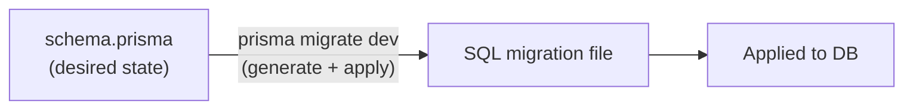
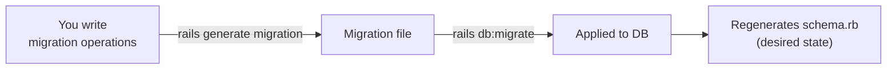
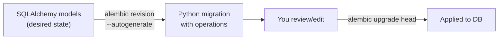

# Database Migration Approaches — Alembic vs Prisma vs Rails

Three approaches to database migrations. Alembic is a hybrid of the first two.

---

## Approach 1 — Desired-state (Prisma)

You write the desired model. The tool diffs the model against the current database and generates the SQL migration automatically. You never write migration operations yourself.



```prisma
model Deal {
  id    Int    @id @default(autoincrement())
  city  String
  price Decimal
}
// Add a field → Prisma generates ALTER TABLE ADD COLUMN automatically
```

- Upside: minimal effort — change the model, get a migration.
- Downsides:
  - you can't edit the generated SQL.
  - data migrations (backfills, column type conversions with data transformation) are not supported inline.
  You must create an empty migration (`prisma migrate dev --create-only`), write raw SQL in it, and hope it stays in sync with the generated ones.

## Approach 2 — Operations-based (Rails)

You write the operations explicitly (`add_column`, `add_index`, `create_table`). Rails executes them and then regenerates the `schema.rb` file — a snapshot of the desired state — so you can see the full schema at a glance.



```ruby
class AddCityToDeal < ActiveRecord::Migration[7.0]
  def change
    add_column :deals, :city, :string
    add_index  :deals, :city
  end
end
```

- Upside: full control over every operation, including data migrations.
- Downside: you must know the exact SQL operations — the framework doesn't figure them out for you.

## Approach 3 — Hybrid (Alembic)

Alembic combines both: you write the desired state as SQLAlchemy models (like Prisma), but Alembic generates a Python migration file with explicit operations (like Rails) instead of raw SQL. You can then review and edit the operations before applying.



```python
# SQLAlchemy model (desired state — what you write)
class Deal(Base):
    __tablename__ = "deals"
    id: Mapped[int] = mapped_column(primary_key=True)
    city: Mapped[str]
    price_per_night: Mapped[Decimal]

# Generated migration (operations — what Alembic produces)
def upgrade():
    op.create_table("deals",
        sa.Column("id", sa.Integer(), primary_key=True),
        sa.Column("city", sa.String(), nullable=False),
        sa.Column("price_per_night", sa.Numeric(), nullable=False),
    )

def downgrade():
    op.drop_table("deals")
```

Upside: you get autogeneration from models (less manual work) plus editable operations (full control). You can add data migrations, split complex changes, or modify what autogenerate produced. Downside: no auto-generated schema snapshot like Rails' `schema.rb` — the source of truth is the chain of migration files plus the models themselves.

### Migration chain

Unlike Prisma, Alembic keeps an explicit **chain of diffs** — each migration file has a `revision` ID and a `down_revision` pointer to the previous one, forming a linked list:

```
(empty DB) ← a1b2c3 "create deals table" ← d4e5f6 "add city index" ← f7g8h9 "add categories" (head)
```

Each file contains only what changed (the diff), not the full schema. To know the current state, you replay the chain from the start. This is different from Rails, where `schema.rb` is a full snapshot regenerated after every migration — you can open one file and see the entire schema. In Alembic, the SQLAlchemy models serve that role (they are the desired state), but there's no auto-generated snapshot file.

Unlike Prisma, these diffs are editable — you can modify, reorder, or add data migrations. Unlike Rails, you don't write the operations from scratch — autogenerate figures them out from model changes.

## Comparison

| | Generate | Apply |
|---|---|---|
| Prisma | `prisma migrate dev` (both) | `prisma migrate dev` (both) |
| Rails | `rails generate migration` | `rails db:migrate` |
| Alembic | `alembic revision --autogenerate` | `alembic upgrade head` |
